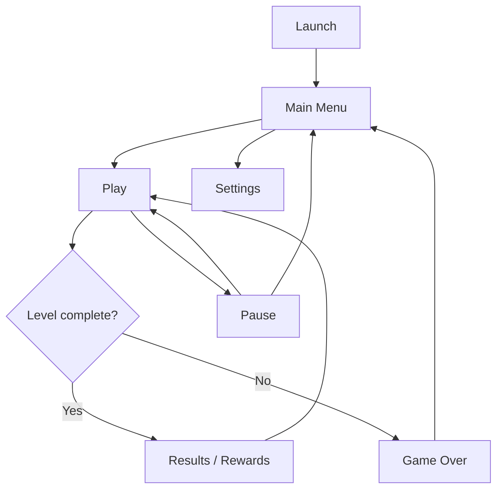

# Game & Screen Flows

> Owner: game-director. Diagrams use Mermaid and render on GitHub.

## Screen flow (placeholder)

```mermaid
flowchart TD
    A[Launch] --> B[Main Menu]
    B --> C[Play]
    B --> D[Settings]
    C --> E{Level complete?}
    E -- Yes --> F[Results / Rewards]
    E -- No --> G[Game Over]
    F --> C
    G --> B
    C --> H[Pause]
    H --> C
    H --> B
```

## Core loop (to do)
